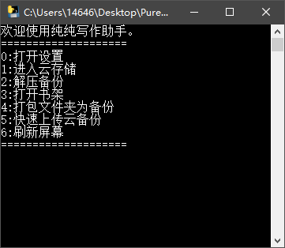
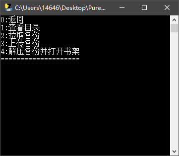
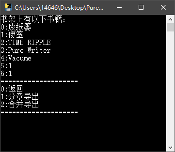
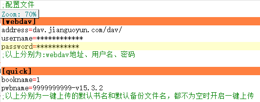

## 纯纯写作助手

#### 简单展示：

<video src="介绍视频.mp4" controls="controls" width="500" height="300">您的浏览器不支持播放该视频！</video>

#### 操作介绍：[点此](https://scueee.github.io/post/pc-duan-chun-chun-xie-zuo-jie-jue-fang-an/)

#### 界面：

#### 支持的功能：

- [x] 云端备份的查看、下载和上传
- [x] 解压 pwb 目录下备份文件
- [x] 打开 db 目录下DB数据库
- [x] 分章节或合并导出书籍
- [x] 打包分章节文件夹为 pwb 备份文件
- [x] 一键打包、一键上传

**注意：使用 webdav、一键打包、一键上传前需要进行配置。**

#### 关于配置文件：

#### 关于打包：

默认打包 output 目录下文件夹，你可以选择在界面里输入需要打包的文件夹名，也可以在配置后一键打包。文件夹名即书名，子文件夹名即分卷名，打包程序会打包整个层级结构为 pwb 备份文件放在 pwb 目录下。

#### 携带版国内下载链接：[点此](https://lanzous.com/icegpzc)
